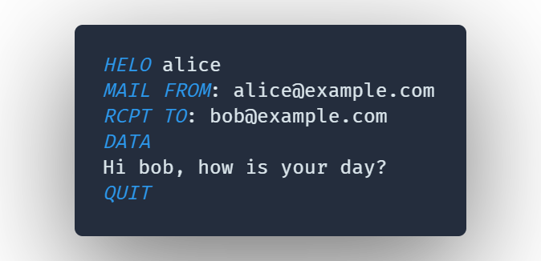

# SMTP Command Support

VSCode extension support mail related commands.

## Features

This extension provides the following features:

SMTP:

-   Syntax highlight for SMTP commands
-   Snippets for SMTP commands

POP3:

-   Syntax highlight for POP3 commands
-   Snippets for POP3 commands
-   Tab completion for POP3 commands

### Syntax highlight

## Release Notes

See [CHANGELOG](./CHANGELOG.md)
